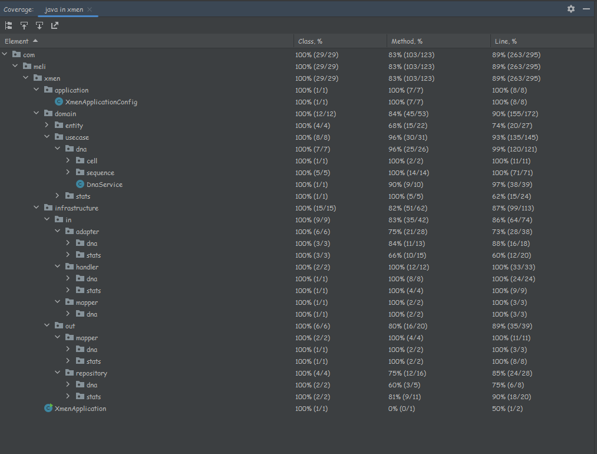
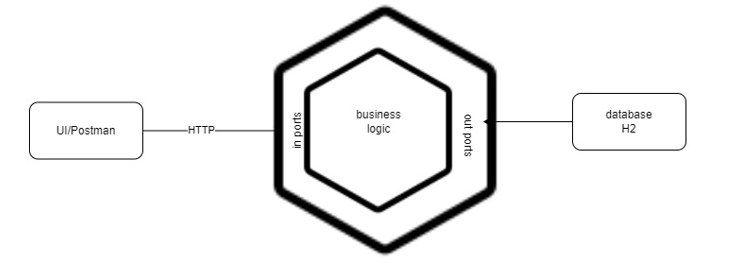
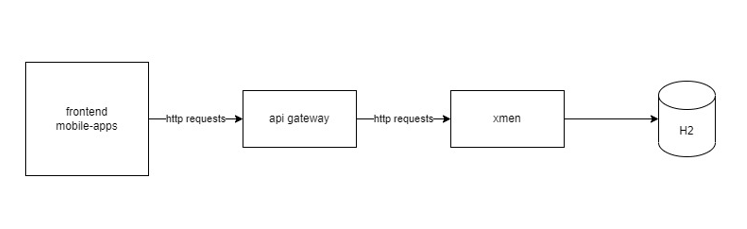

# Introduction
This <b>project</b> provides and API in order to validate if a given blood belongs to a Human or to a Mutant:

- Send blood to an endpoint in order to be validated.
- Retrieved metrics of the blood sent in order to know the ratio between Human blood vs Mutant blood.

## Tooling
| Technology	 | 	Version |
|-------------|----------|
 | Java        | 	17      |
 | Maven		     | 	>3.8    |
 | SpringBoot	 | >3       |
 | Jacoco      | 0.8.8    |	


## Code coverage


## Installation and Execution
Feel free to download and run the application locally.
```
spring-boot:run
```
In case of wanting to run the application as a Container, please see the [Dockerfile](./Dockerfile) and proceed to follow the steps needed in the [official documentation](https://docs.docker.com/language/nodejs/build-images/).

The application is deployed on Elastic Beanstalk under the server url: http://xmenapplication-env.eba-yr372kma.us-east-1.elasticbeanstalk.com

## Architecture

Some concepts and implementation of this code were considering the [reactive manifesto](https://www.reactivemanifesto.org/):
1. Elastic architecture.
2. Error handling with Vavr.
3. Functional programming (when possible).

The application was built implementing concepts of [Domain Driven Design](https://martinfowler.com/bliki/DomainDrivenDesign.html)

In this case it was considered the following Domains:
- DNA : validation of mutant or human blood
- Stats : statistics or metrics about validations done to blood in previous domain

### AWS
The application is being deployed in [Elastic Beanstalk, AWS](https://docs.aws.amazon.com/elastic-beanstalk/index.html).

Elastic Beanstalk handles automatically and eases:
1. setup
2. configuration
3. provisioning
4. traffic to instances (load balancing)
5. monitoring 
6. deployment

In case of pretending to run the application in a production environment, in an enterprise environment, different conditions should be taken into account and another architecture sould be implemented:
1. manual setup of networking
2. manual setup of ingress and egress configuration
3. monitoring, tracing and observability should be set
4. autoscaling and provisioning should be configured
5. auto-recovery policies and strategies should be implemented

Possibly the previous conditions would mean having a different architecture in terms of cloud computing.

Concepts of [Clean Architecture](https://blog.cleancoder.com/uncle-bob/2012/08/13/the-clean-architecture.html) were considered in this implementation, therefore the packaging naming conventions and packages definition.




Packages were divided into the following layers:
```
application
domain
infrastructure
```
#### Application Layer
Contains the configuration in order to launch the application.
#### Domain Layer
Contains the configuration of the domain: entities, services, behaviours, validations.
#### Infrastructure Layer
Contains the configuration of the ports and adapters of the application. Communication to database and exposure of endpoints.

An overview of the communication of the different components is:



## Usage
There are 2 endpoints exposed:

1. Validate if blood belongs to a mutant or human
```
POST http://{server}:{port}/api/v1/mutants 
```
Should send the following payload:
```
{
    "dna" : [
        "ATGCGA", 
        "CAGTGC", 
        "TTATGT", 
        "AGAAGG", 
        "CCCCTA", 
        "TCACTG"
        ]
}
```
Returns the following payload:
```
{
    "message": null,
    "isMutant": true
}
```

2. Retrieve stats
```
GET http://{server}:{port}/api/v1/stats
```
Returns the following payload:
```
{
    "message": null,
    "stats": {
        "countMutantDna": 0,
        "countHumanDna": 0,
        "ratio": 0.0
    }
}
```
For both endpoints there is the `message` field. This should be null unless an error code is returned (4xx or 5xx).


## Pending implementations
The following bullets represent future work to be added:

- [ ] Async implementation. A good practice is to add CompletableFutures or CompletionStage in endpoints to make everything async. (https://docs.oracle.com/javase/8/docs/api/java/util/concurrent/CompletionStage.html)
- [ ] Add a pipeline to deploy automatically in AWS with the help of GitHub actions.
- [ ] Add a tracing tool (i.e Zipkin). (https://zipkin.io/pages/quickstart)
- [ ] Add Vavr Either in all the communication with the database (https://www.baeldung.com/vavr-either)
- [ ] Add logs in more detail in different places, masking sensitive data.
- [ ] Change of AWS architectural deployment.
- [ ] Improve unit and integration testing (this means increasing coverage).
- [ ] Addition of performance testing. A great tooling is JMeter or Gatling. (https://www.baeldung.com/gatling-jmeter-grinder-comparison)


## Issue
This repository is maintained actively, so if you face any issue please <a href="https://github.com/bazzo03/xmen/issues/new">raise an issue</a>.